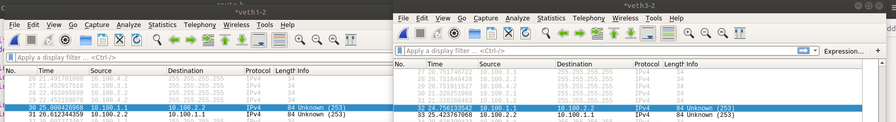
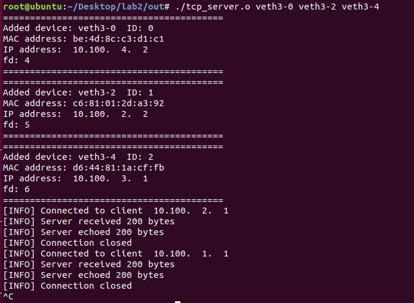
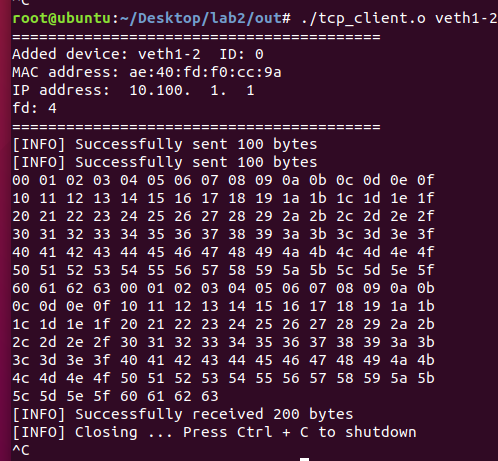
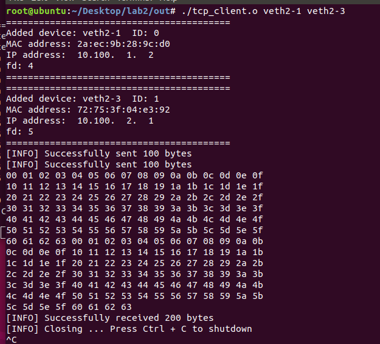
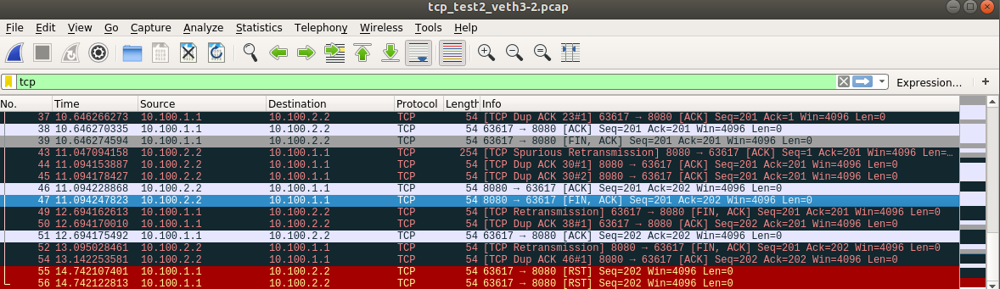
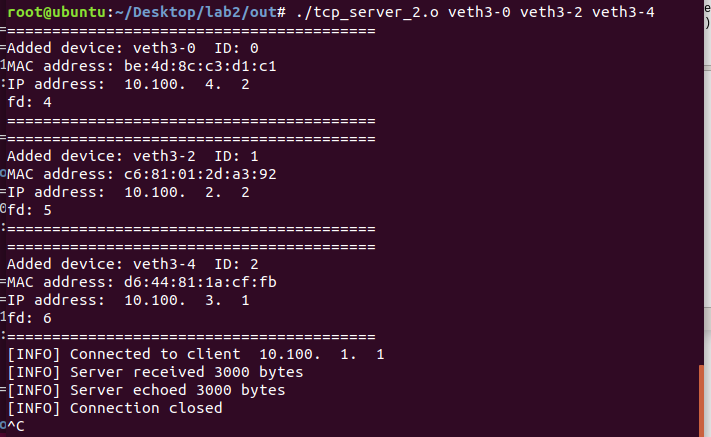
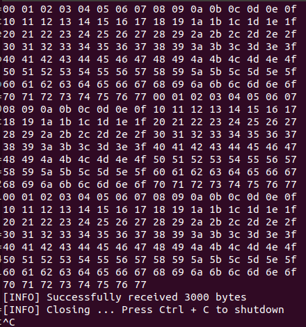
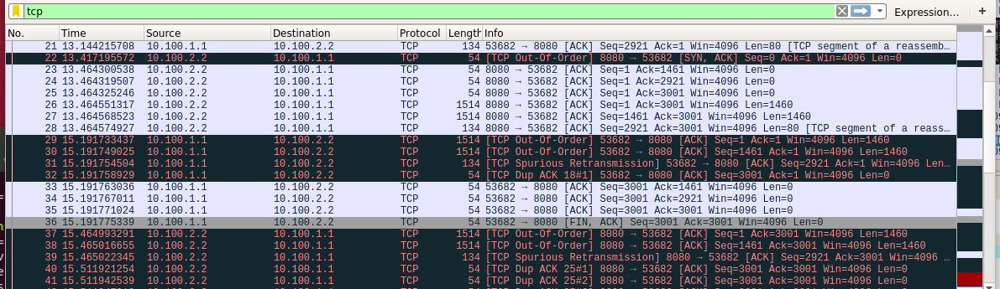

# Codelist for each programming task

## Link-layer: Packet I/O On Ethernet

- Functions for manage devices are in `inc/device.h`
- Functions for sending and receiving Ethernet frames are in `inc/packetio.h`
- Helper functions are in `inc/packetio.h`
- Test files are in `test`
  - `print_my_mac.cpp` is used to print one device's mac address
  - `mac_client.cpp` and `mac_server.cpp` should be run on veth1-2 and veth2-1 respectively in the example network, they implement a simple 'echo function' to output all the received packets as they are
- Run `./compile.sh` could generate binary files in the `test` folder

## Network-layer: IP Protocol

- Functions related to routing are in `inc/route.h`
- Functions related to IP packets processing are in `inc/ip.h`
- Test files are in `test`
  - `print_my_ip.cpp` is used to print one device's ip address
  - `ip_client.cpp` and `ip_middle.cpp` and `ip_server.cpp` should be run on host 1, 2, 3 respectively, the server echoes the messages sent from client to server and the result shows below:
  - 
  - **Notes after finishing transport layer: ** as I modified interface in the IP layer, this program cannot run correctly now, but with some modifications it can still work.

## Transport-layer: TCP Protocol

- Functions related to TCP state machine are in `inc/tcp.h`

- Functions related to POSIX interface are in `inc/socket.h`

- test1

  - `tcp_client.cpp` and `tcp_server.cpp` can be used to test the POSIX interface

  - We tried to run client on ns1, ns2 almost concurrently and server on ns3

  - Message from ns3

    

  - Message from ns1

    

  - Message from ns2

    

  - We also saved the pcap files for two tries `tcp_test1_*.pcap` and `tcp_test2_*.pcap`, the variety of data can show the robustness of our program. A screenshot is shown below:

    

- test2

  - `tcp_client_1.cpp` and `tcp_server_2.cpp` are used to test super large information sent across network which are easily lost and over buffer size

  - They are run on host ns1 and ns3 respectively, while `ip_middle.cpp` is run on ns2 as a router

  - the result is as below:

    

    

  - The pcap files are also saved and named as `tcp_test3_*.pcap`

  - A wireshark screen shot is as follow:

    

