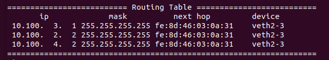

# Writing tasks

## Network-layer: IP Protocol

1. `sendFrame()` requires the caller to provide the destination MAC address when sending IP packets, but users of IP layer won't provide the address to you. Explain how you addressed this problem when implementing IP protocol.

   If there is an entry in the routing table, then we just use the routing table to fill up the MAC address. Otherwise, we flood the packet by set MAC address to broadcast `ff:ff:ff:ff:ff:ff` and it will finally arrive at the right host. Besides we have an alarm thread which will periodically send out meaningless IP packets without any contents in them to help other hosts to set up their routing table. After enough time, the routing table will be filled up with right MAC addresses of the correct next hop.

   

2. Describe your routing algorithm. 

   We use flooding as our routing method. The details are as follows:

   - If we don't know the MAC address, we just send a broadcast frame; otherwise we just lookup the routing table
   - Each time we receive an IP packet, we record the source address and identification field in the header as an **identifier** for a packet. Due to flooding, we might receive the same packet twice and we just ignore packets with same **identifier**. And their is also an forgetting mechanism, every time the number of different identifier exceeds a given threshold, it will forget the oldest packets and only half the threshold remains.
   - Each time we receive an new IP packet (different **identifier**), we just use information on this packet to update our routing table, we use the source MAC address as next hop, source IP address as destination IP
   - Each routing table entry will timeout at a given constant time and be cleaned up

   Something helps the routing method:

   - We send out meaningless IP packets periodically to help all the hosts set up routing table rather than always sending broadcast packets and destroy the network.

   

3. To implement routing properly, you need to detect other hosts/let other hosts know about you. In this lab, you are not required to detect hosts not running your protocol stack automatically/let them know about you, but you must not make them complain about strange incoming packets. Describe how your IP implementation achieved this goal.

   We set the protocol field in headers of IP packets to be `0xfd` (`253` in decimal) which stand for experimental purpose. So hosts not running our protocol stack will just ignore our packets with strange information, while other normal IP packets won't make them complain.

**Corner Cases**

- Our program can handle situations when one host suddenly fail or setup and quickly converge to the right routing table within about one minute through the method described above
  - 
  - 
  - 

## Transport-layer: TCP Protocol

1. Describe how you correctly handled TCP state changes.

   Just follow the RFC793 standard is OK, as the doc includes detailed description about how to change under different situations. We copied the corresponding part to the annotations in the codes accompanying each implementation.

2. Describe how you implemented in-order data transferring.

   We use a Go-Back-N like algorithm. For the receiver part, each time the data arrives, we only accept it when it contains the part that includes RCV_NXT (the next expected data). For the sender part, it has a global timer, each time a new acceptable ACK arrives the timer restart, and when timeout after 2 seconds it will retransmit the segment.

## Test/Evaluation

We did a layering evaluation for each layer. After confirming the correctness of one layer, we begin the implementation of the next layer and these separate evaluation support as a whole the correctness of our protocol stack.

The implementation for each layer is a layer-specific echo function implementation. For the details and results, please refer to `codelist.md` for more information.